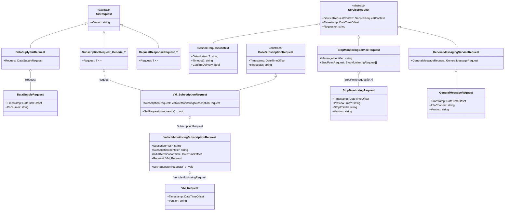
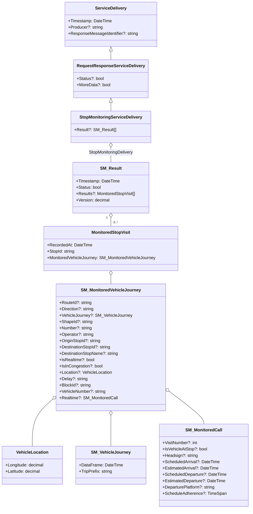
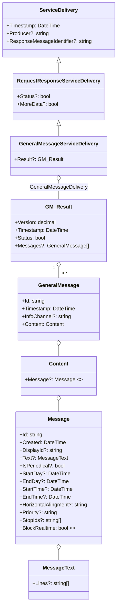

# Mtd.Siri.Core

[](https://github.com/CUMTD/Mtd.Siri.Core/actions/workflows/built-test.yml)


## GitHub NuGet Feed

See instructions in [Mtd.Core](https://github.com/CUMTD/Mtd.Core) for information about using the GitHub NuGet feed.

## Class Diagrams


### Reqeuests




### Responses

### Generic Delivery

```mermaid
```

#### VM

```mermaid
classDiagram
    %% Inheritance
    ServiceDelivery <|-- VehicleMonitoringServiceDelivery

    %% Composition tree
    VehicleMonitoringServiceDelivery o-- VehicleMonitoringDelivery
    VehicleMonitoringDelivery "1" o-- "0..*" VehicleActivity : VehicleActivity
    VehicleActivity o-- VM_MonitoredVehicleJourney : MonitoredVehicleJourney
    VehicleActivity o-- ProgressBetweenStops
    VehicleActivity o-- Extensions
    Extensions o-- OccupancyDataExtension

    VM_MonitoredVehicleJourney o-- FramedVehicleJourneyRef
    VM_MonitoredVehicleJourney o-- VehicleLocation
    VM_MonitoredVehicleJourney o-- VM_MonitoredCall : MonitoredCall
    VM_MonitoredVehicleJourney o-- OnwardCall : FutureStops[0..*]
    VM_MonitoredVehicleJourney o-- PreviousCall : PreviousStops[0..*]

    class ServiceDelivery {
        +Timestamp: DateTime
        +Producer?: string
        +ResponseMessageIdentifier?: string
    }

    class VehicleMonitoringServiceDelivery {
        +Delivery?: VehicleMonitoringDelivery
    }

    class VehicleMonitoringDelivery {
        +Timestamp: DateTime
        +Subscriber?: string
        +Subscription?: string
        +Status?: bool
        +VehicleActivities?: VehicleActivity[]
        +Version: decimal
    }

    class VehicleActivity {
        +RecordedAt: DateTime
        +ItemIdentifier?: string
        +Expiration: DateTimeOffset
        +IsValid: bool
        +VehicleMonitoringRef?: string
        +ProgressBetweenStops?: ProgressBetweenStops
        +VehicleJourney: VM_MonitoredVehicleJourney
        +Extensions?: Extensions
    }

    class VM_MonitoredVehicleJourney {
        +RouteId?: string
        +Direction?: string
        +FramedVehicleJourneyRef?: FramedVehicleJourneyRef
        +ShapeId?: string
        +RouteNumber?: string
        +Operator?: string
        +OriginStopId?: string
        +DestinationStopId?: string
        +DestinationStopName?: string
        +IsMonitored?: bool
        +MonitoringError?: string
        +IsInCongestion?: bool
        +IsInPanic?: bool
        +Location?: VehicleLocation
        +Delay?: string
        +BlockId?: string
        +VehicleNumber?: string
        +DriverNumber?: string
        +DriverName?: string
        +PreviousStops?: PreviousCall[]
        +MonitoredCall?: VM_MonitoredCall
        +FutureStops?: OnwardCall[]
    }

    class FramedVehicleJourneyRef {
        +DataFrameRef: DateTime
        +DatedVehicleJourneyRef: string
    }

    class VehicleLocation {
        +Latitude: decimal
        +Longitude: decimal
    }

    class VM_MonitoredCall {
        +VisitNumber?: int
        +StopName?: string
        +VehicleIsAtStop?: bool
        +Headsign?: string
        +ScheduledArrival?: DateTime
        +ExpectedArrival?: DateTime
        +ScheduledDeparture?: DateTime
        +ExpectedDeparture?: DateTime
    }

    class OnwardCall {
        +VisitNumber: byte
        +StopName: string
        +StopId: string
        +ScheduledArrival: DateTime
        +ExpectedArrival: DateTime
        +ScheduledDeparture: DateTime
        +ExpectedDeparture: DateTime
    }

    class PreviousCall {
        +VisitNumber: byte
        +StopName: string
        +StopId: string
        +ScheduledArrival: DateTime
        +ScheduledDeparture: DateTime
    }

    class ProgressBetweenStops {
        +LinkDistance: ushort
        +Percentage: decimal
    }

    class Extensions {
        +OccupancyData: OccupancyDataExtension
    }

    class OccupancyDataExtension {
        +OccupancyPercentage: float
        +PassengersNumber: int
        +VehicleCapacity: int
        +VehicleSeatsNumber: int
    }
```

#### SM




#### GM




```mermaid

```


```mermaid

```


```mermaid

```

```mermaid

```